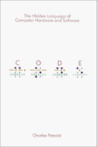
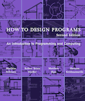

# A Craft of Automatery
#### Jan 2019, 2 mins read

Here, I will list resources that you can use to learn pretty much
everything I know about Computer Science and Programming.   
I'm amazed by how accessible it is, and I say this without exaggeration,
to become a profissional Programmer wihtout needing more than a computer and an
internet connection! I highly encourage you to take advantage of this.
Countless high quality resources are available, mostly at no cost, for you to explore or learn this craft.  

I believe university trained me in mathematical rigour and analysis, but the actual Computer Science I learned myself.
However, having been guided by world-class Computer Scientists and Mathematicians at the
University of Waterloo, was, without a doubt, a priceless privilage that only so many are lucky to have, but it is not a requirment, 
at least not in Computer Science.

## Setup
### Prefer Linux or macOS over Windows.
If you're a windows user, [dual boot](https://www.howtogeek.com/187789/dual-booting-explained-how-you-can-have-multiple-operating-systems-on-your-computer/)
a Linux distrbution next to Windows, I recommend [Ubuntu](https://www.ubuntu.com/) for its easy of use and a smooth install/configuration experience.
Here's a tutorial to walk you through the steps: [How To install Ubuntu.](https://www.youtube.com/watch?v=vt5Lu_ltPkU) You can still use Windows if you'd like,
I just personally don't recommend it.

### The Command Line
Learn how to work with a command line interface.
Here's a [tutorial](https://ryanstutorials.net/linuxtutorial/)  

### Code Editor
Many good options exists, I personally use [Neovim](https://neovim.io/), but it's not beginner friendly, and I frankly cant offer
an argument on how it could benefit you in the long run. Other beginner friendly options:  
* [Sublime Text](https://www.sublimetext.com/)
* [Atom](https://atom.io/)
* [Visual Studio Code](https://code.visualstudio.com/)

## Compute

### Code

  
[Code By Charles Petzold](https://www.amazon.com/Code-Language-Computer-Hardware-Software/dp/0735611319/ref=sr_1_1?keywords=code&qid=1548065077&sr=8-1)
  
You probably wondered how Computers turn strings of binary digits (0s and 1s)
into meaning, this is explained beautifully in *Code.*
I read this book in highschool, and I keep getting back to it from time to time,
it provided me with a solid understanding of how a computer works. By the end of
the first 9 chapters, you should understand how we abstract and manipulate natural numbers to imitate
our brains, how only two symbols are needed to convey everything there is to
convey.
You should also answer the question, Why only two symbols? why not one symbol,
or Three?  
> Note: You don't have to keep reading after chapter nine, unless you're
interested.
### Expressing Computation & designing Programs
Learn how to communicate intent to a computer, and I am intentionally not using
"learn a programming language" here for a reason.  
The goal is not to learn a language, but how programs are designed and
implemented. There are many styles and many languages to choose from, and for
learning purposes, I recommend [Racket](https://racket-lang.org/) to learn functional programming,
then [C](https://en.wikipedia.org/wiki/C_(programming_language)#C99) to learn imperative programming.  
Dont attempt to learn both at the same time, I highly recommend beginning with
a [Dr.Racket](https://download.racket-lang.org/) while using [How To Design Programs](https://htdp.org/) as a reference and
a curriculum.  
  
[The C Programming Language](https://www.amazon.com/Programming-Language-2nd-Brian-Kernighan/dp/0131103628/ref=sr_1_1?crid=13IOY3V74A4K1&keywords=the+c+programming+language&qid=1548081750&sprefix=the+c+prog%2Caps%2C159&sr=8-1)
is an excellent reference to use while learning C.  
  

## Mathematics
Computer Science is a subfield of Mathematics, and Mathematical maturity is
assumed in theoritcal computer science, 
[Mathematics for Computer Science](https://ocw.mit.edu/courses/electrical-engineering-and-computer-science/6-042j-mathematics-for-computer-science-fall-2010/)
is an MiT ccourse that covers a wide range of topics such as Proof Construction,
Set Theory, Graph Theory, Counting.
### Measurement Of Change
Single-Variable [Differential](https://www.edx.org/course/calculus-1a-differentiation) and [Integral](https://www.edx.org/course/calculus-1b-integration) Calculus.
### Abstraction
Pay careful attention to Linear Algebra if you're aiming to make video games. A
reference that have been constantly recommended on the topic is 
[Linear Algebra Done Right](http://linear.axler.net/)
## Basics

### Time
We dont meaure the efficiency of algorthims based on time, rather, number of
operations relative to the size of input.
### Data Structures & Elementary Algorthims
### Object Oriented Programming
### Design Patterns & Software Architecture
### Assembly & Computer Architecture
### The Annotated Turing and Sequential Programs
### Compilers
### Language
Rust
Haskell
Go
Avoid
Java
Javascript
Python
C++
C#

## Advanced Topics

### Algorthims

### operating system

### Models of Computation

### Complexity Theory

### Computational Mathematics

### Concurrency & Parrallism

### Real Time Programming

## Applications

### Graphics

### Artifical Intelligence & Machine Learning

### Game Development

### User Interfaces

### Web Development

### Security and Privacy
