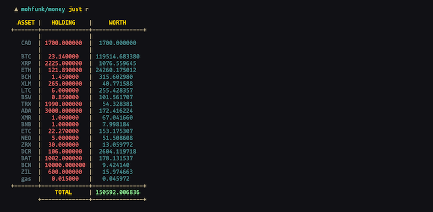

# Money
#### A personal finance app written in Go

I needed a cli app to track and manage my personal finances and trades, I
couldnt find anything that fits my needs. Since Go was an absolutle pleasure to
work with, I got very motivated to write one!

## Features

### Implemented

* Net worth

    - Supports Fiat Currencies, Cryptocurrencies, and Precious Metals
    - Calculates all rates in less than a second, thanks to goroutines.
    - Multiple base Currencies can be used.
---

* Trading

    - Tracks trading activity, currently trades have to be manually added.
---

### Planned

* Daily/weekly/monthly/yearly budget
* Subscrptions
* Automatic spending detection
* Algorthimic trading

[github.com/mohfunk/money](https://github.com/mohfunk/money)
